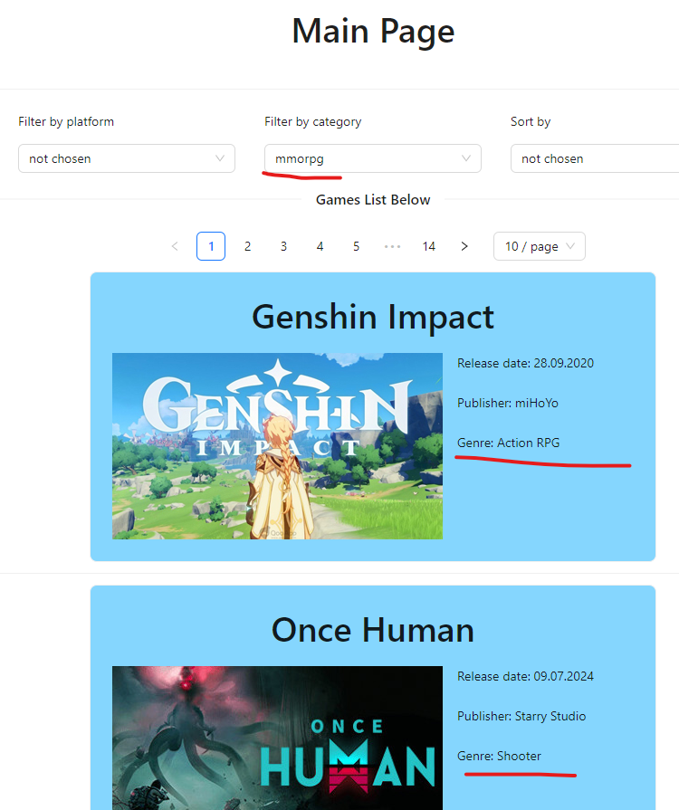
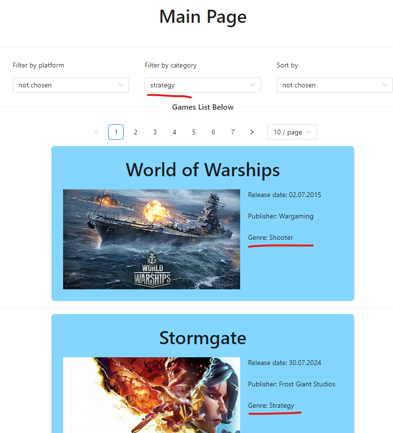
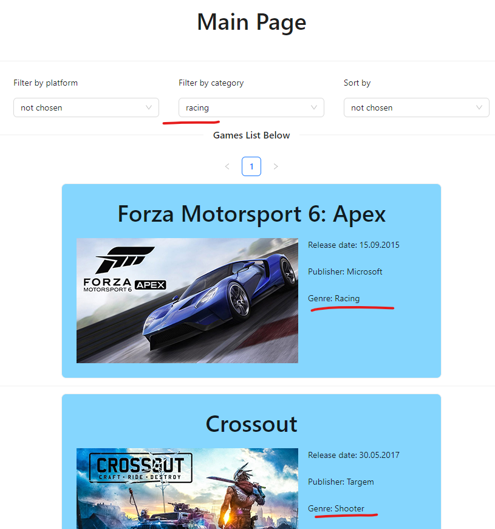

# Баг-репорт задания 2

В ходе тестирования были обнаружены следующие баги:

## Баг 1: Неправильный результат фильтрации

### Описание:
При фильтрации по категории на странице отображаются игры из других категорий.

### Шаги для воспроизведения:
1. Открыть сайт по адресу https://makarovartem.github.io/frontend-avito-tech-test-assignment/ .
2. Выбрать необходимую категорию.
3. Нажать на кнопку фильтрации.

### Ожидаемый результат:
На странице отображаются только игры выбранной категории.

### Фактический результат:
На странице отображаются игры из разных категорий.

